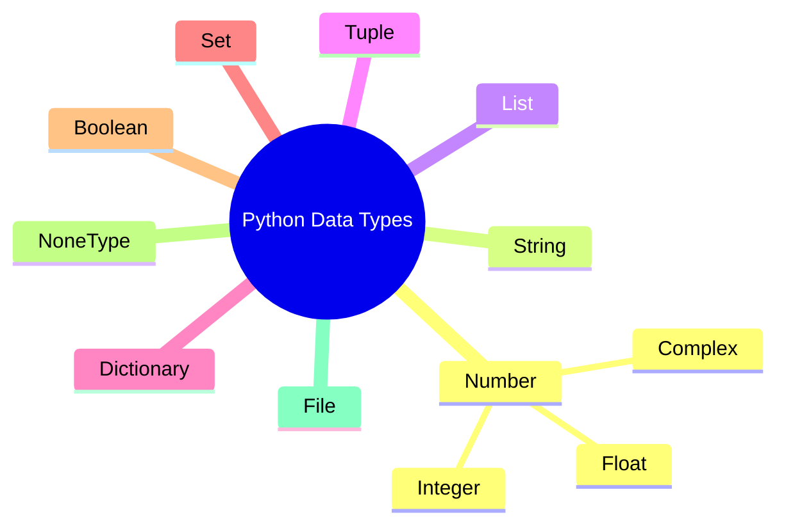
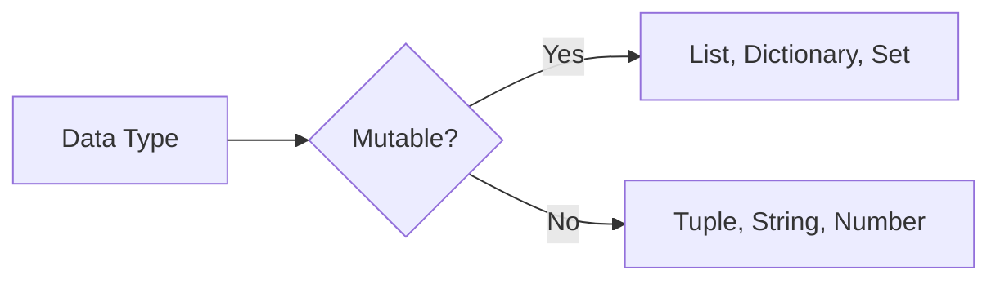

````md
# 🧩 Python Data Types  

## 📚 Table of Contents

1. 🌱 Overview  
2. 🔑 What Are Data Types?  
3. 🧱 Core Python Data Types  
   - Numbers  
   - Strings  
   - Lists  
   - Tuples  
   - Dictionaries  
   - Sets  
   - Booleans  
   - NoneType  
   - Files  
4. 🖼️ Visual Diagrams  
5. 💡 Pro Tips  
6. 🧪 Practice Set (with hidden answers!)

---

## 🌱 Overview

In Python, **everything is an object**, and every object has a **data type**.

👉 A **data type** tells Python:
- What kind of data it is
- What operations can be done on it
- How it is stored in memory

Think of data types as **containers** 📦 — each container has rules about what it can hold and how you can use it.

---

## 🔑 Why Data Types Matter 🤔

Without data types:
- Python wouldn’t know how to add, compare, or store data
- Programs would behave unpredictably

With data types:
- Code becomes **safe**, **readable**, and **powerful**

---

## 🧱 Core Python Data Types

Let’s explore them one by one, from simple to powerful 💪

---

## 🔢 1. Number

Used to store numeric values.

### Types of Numbers:
- **Integer (int)** → whole numbers  
- **Float (float)** → decimal numbers  
- **Complex (complex)** → real + imaginary numbers  

```python
myint = 132322
myfloat = 9.81
mycomplex = 1 + 2j
````

🧠 **Analogy**:
Numbers are like values on a calculator 🧮

---

## 🔤 2. String

Used to store text (characters).

```python
mystring = "Hello, World!"
```

* Always enclosed in quotes (`" "` or `' '`)
* Immutable (cannot be changed once created)
* mystring[0] gives 'H'
* mystring[-1] gives '!'
* it gives the character at that index from last if it is negative
* mystring[1:5] gives 'ello' first index is inclusive and last index is exclusive
🧠 **Analogy**:
Strings are like words written with permanent ink ✍️

---

## 📋 3. List

An **ordered, mutable collection** of items.

```python
mylist = [10, 20, 30, 40, 50]
```

* Can store **different data types**
* Items can be changed (mutable)
* Similar to arrays, but **more powerful**
* len(mylist) gives the length of the list
* 

🧠 **Analogy**:
A list is like a shopping list 🛒 — you can add or remove items anytime.

---

## 📦 4. Tuple

An **ordered, immutable collection**.

```python
mytuple = (100, 200, 300, 400, 500)
```

* Cannot be changed after creation
* Faster and safer than lists in some cases

🧠 **Analogy**:
A tuple is like a sealed package 📦 — contents can’t be altered.

---

## 🗂️ 5. Dictionary

Stores data as **key–value pairs**.

```python
mydict = {"name": "Alice", "age": 30, "city": "New York"}
```

* Keys must be unique
* Values can be any data type
* Similar to hashmaps or objects in other languages

🧠 **Analogy**:
A dictionary is like a real dictionary 📖 — you look up meanings using words (keys).

---

## 🧺 6. Set

An **unordered collection of unique items**.

```python
myset = {10, 20, 30, 40, 50}
```

* No duplicates allowed
* Order is not preserved

🧠 **Analogy**:
A set is like a bag of unique coins 🪙 — no duplicates allowed!

---

## ✅ 7. Boolean

Represents truth values.

```python
mybool = True
```

* Only two values: `True` or `False`
* Often used in conditions and logic

🧠 **Analogy**:
Booleans are like light switches 💡 — ON or OFF.

---

## 🚫 8. NoneType

Represents the **absence of a value**.

```python
mynone = None
```

* Not zero
* Not empty
* Just… nothing

🧠 **Analogy**:
An empty box 📭 — it exists, but contains nothing.

---

## 📂 9. File

Used to read from or write to files.

```python
myfile = open("data.txt", "w")
```

* Represents a file object
* Modes: read (`"r"`), write (`"w"`), append (`"a"`)

🧠 **Analogy**:
A file object is like opening a book 📘 — you can read or write inside it.

---

## 🖼️ Visual Overview Diagram



---

## 🔄 Mutable vs Immutable (Important!)



---

## 💡 Pro Tips (Level Up! ⬆️)

* Use **lists** when data changes frequently
* Use **tuples** for fixed data
* Use **sets** to remove duplicates
* Use **dictionaries** for fast lookups
* Use **None** to represent missing values safely

---

## 🧪 Practice Set – Test Your Mastery! 🎯

### 🟢 Easy

1. Which data type stores text?
2. What keyword represents “no value” in Python?

### 🟡 Medium

3. Identify the data type: `{1, 2, 3}`
4. Why are tuples considered safer than lists?

### 🔵 Hard

5. Write a list containing an integer, string, and boolean.
6. Convert a list into a set — what happens?

### 🧠 Diagram Challenge

7. Draw a diagram showing mutable vs immutable data types.

### ⭐ Bonus Challenge

8. Create a dictionary storing student name, age, and grades.

---

<details>
<summary>✅ Answers (Click to Reveal)</summary>

1. String
2. None
3. Set
4. They are immutable
5. `[1, "Hello", True]`
6. Duplicates are removed
7. (Refer to diagram above)
8. `{"name": "John", "age": 20, "grades": [85, 90, 92]}`

</details>

---

## 🎉 Final Takeaway

> **Understanding data types is the foundation of Python mastery.**

Once you know:

* What data you have
* How it behaves
* When to use which type

You can write **cleaner, safer, and more powerful code** 🚀

Happy Learning! 🧠✨

```
```
