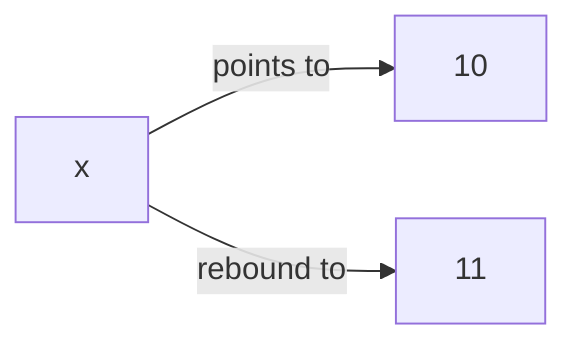
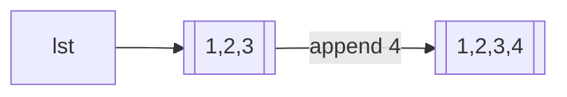
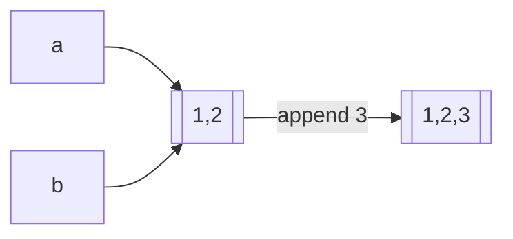
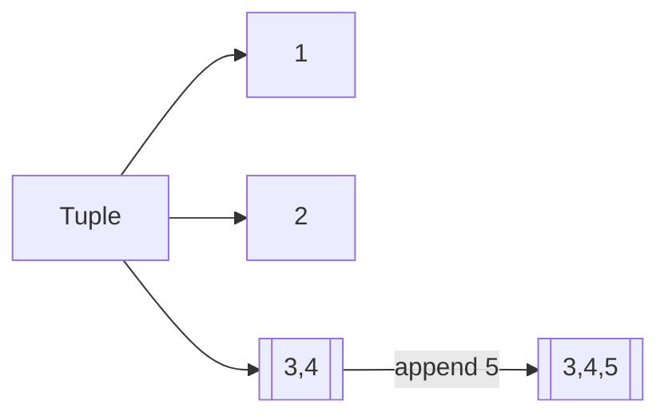
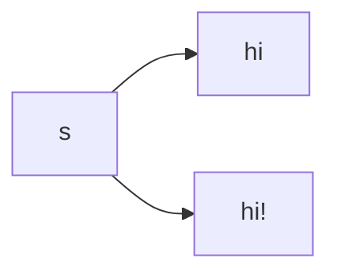
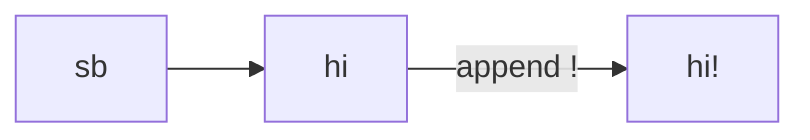
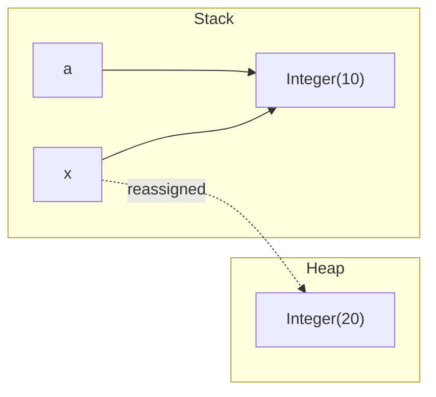
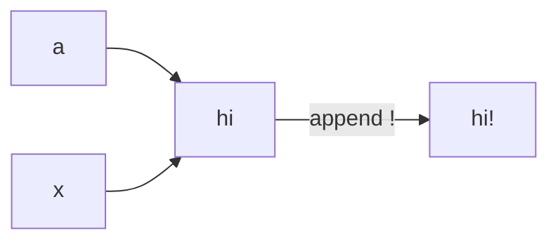
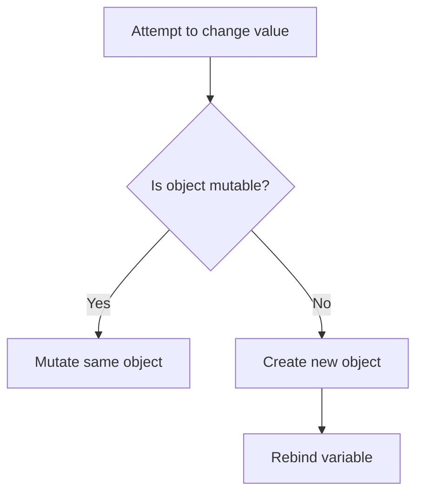

Awesome choice 👍 — **Mermaid diagrams make this 10× clearer**, especially on GitHub.

Below is a **fully updated, ready-to-commit Markdown file** with **Mermaid flowcharts + stack/heap diagrams**, covering **mutability vs immutability in Python and Java**, exactly aligned with everything we discussed.

You can save this as:

```
mutability_vs_immutability_python_java.md
```

GitHub, VS Code, and many Markdown viewers will render these diagrams automatically.

---

````md
# 🔐 Mutability vs Immutability  
## Python vs Java — Deep Understanding with Mermaid Diagrams

---

## 1. Core Definition ⭐

> **Mutability describes whether an object’s internal state can change after creation.**

⚠️ Important:
- Mutability is about **objects**
- NOT about variables
- NOT about reassignment

---

## 2. Python Object Model

### Key Rules
- Everything in Python is an **object**
- Variables are **names bound to objects**
- Objects decide **mutability**

---

## 3. Immutable Objects in Python

### Common Immutable Types

| Type | Immutable |
|----|----|
| `int` | ✅ |
| `float` | ✅ |
| `bool` | ✅ |
| `str` | ✅ |
| `tuple` | ✅ |
| `frozenset` | ✅ |

---

### Example: Integer Reassignment

```python
x = 10
x = x + 1
````

### Mermaid: Rebinding (Not Mutation)



✔ Old object unchanged
✔ New object created
✔ Name rebinding

---

## 4. Mutable Objects in Python

### Common Mutable Types

| Type   | Mutable |
| ------ | ------- |
| `list` | ✅       |
| `dict` | ✅       |
| `set`  | ✅       |

---

### Example: List Mutation

```python
lst = [1, 2, 3]
lst.append(4)
```

### Mermaid: In-Place Mutation



✔ Same object
✔ Internal state changed

---

## 5. Python’s Biggest Trap ⚠️

```python
a = [1, 2]
b = a
b.append(3)
```

### Mermaid: Shared Reference



✔ `a` and `b` point to the same object
✔ Mutation visible everywhere

---

## 6. Immutable Container with Mutable Content (Python)

```python
t = (1, 2, [3, 4])
t[2].append(5)
```

### Mermaid: Nested Mutability



✔ Tuple unchanged
✔ Inner list mutated

---

## 7. Java Object Model

### Java Has:

* **Primitives** (`int`, `double`)
* **Objects** (`String`, `Integer`, `ArrayList`)

Mutability applies **only to objects**.

---

## 8. Primitives in Java (Not Objects)

```java
int a = 10;
a = 20;
```

✔ No immutability concept
✔ Simple value replacement

---

## 9. Immutable Objects in Java

### Common Immutable Classes

| Class     | Immutable |
| --------- | --------- |
| `String`  | ✅         |
| `Integer` | ✅         |

---

### Example: String Reassignment

```java
String s = "hi";
s = s + "!";
```

### Mermaid: New Object Creation



✔ New object
✔ Old string unchanged

---

## 10. Mutable Objects in Java

### Example: StringBuilder

```java
StringBuilder sb = new StringBuilder("hi");
sb.append("!");
```

### Mermaid: In-Place Change



✔ Same object
✔ Internal mutation

---

## 11. Redeclaration vs Immutability (Java)

```java
Integer a = 10;
Integer a = 20; // ❌ compile-time error
```

🚫 Reason: **redeclaration in same scope**
❌ NOT immutability

---

## 12. Java Pass-by-Value (Classic Confusion)

### Code

```java
void f(Integer x) {
    x = 20;
}

Integer a = 10;
f(a);
System.out.println(a);
```

### Output

```
10
```

---

### Mermaid: Stack & Heap Diagram



✔ Reference value copied
✔ `x` reassigned locally
✔ `a` unchanged

---

## 13. Java with Mutable Object

```java
void f(StringBuilder x) {
    x.append("!");
}
```

### Mermaid: Shared Mutation



✔ Same object
✔ Mutation visible outside

---

## 14. Python vs Java — Philosophy

| Aspect                   | Python        | Java       |
| ------------------------ | ------------- | ---------- |
| Everything is object     | ✅             | ❌          |
| Mutability runtime-based | ✅             | ❌          |
| Compile-time enforcement | ❌             | ✅          |
| Variable redeclaration   | Not a concept | ❌          |
| Pass-by-value            | Names         | References |

---

## 15. Flowchart: Mutation vs Reassignment



---

## 16. Why Immutability Matters

✔ Thread safety
✔ Predictable behavior
✔ Safe sharing
✔ Hashable keys
✔ Easier debugging

---

# 🧠 Tricky Questions (Test Yourself)

### Q1 (Python)

```python
a = "hi"
b = a
a += "!"
print(b)
```

✔ `hi`

---

### Q2 (Python)

```python
a = [1, 2]
b = a
a += [3]
print(b)
```

✔ `[1, 2, 3]`

---

### Q3 (Java)

```java
String a = "hi";
String b = a;
a += "!";
System.out.println(b);
```

✔ `hi`

---

### Q4 (Java)

```java
Integer a = 100;
Integer b = 100;
System.out.println(a == b);
```

✔ `true` (Integer cache)

---

### Q5 (Java)

```java
void f(Integer x) {
    x = 20;
}
```

✔ Reassignment does NOT affect caller

---

## 17. Final Mental Model ⭐

### Python

> Names point to objects. Objects decide mutability.

### Java

> Variables obey scope rules. Objects control mutability. Compiler enforces safety.

---

## 18. One-Line Exam Summary

> Mutability determines whether an object’s internal state can change, while reassignment only changes which object a variable refers to.


